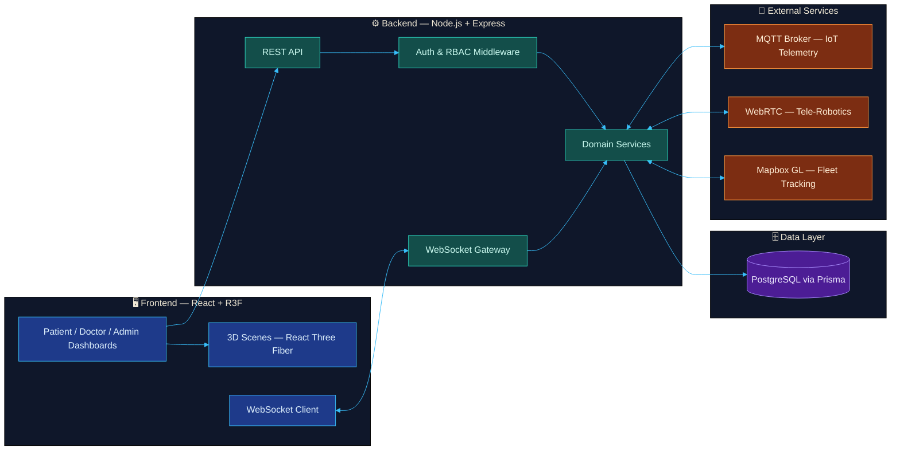
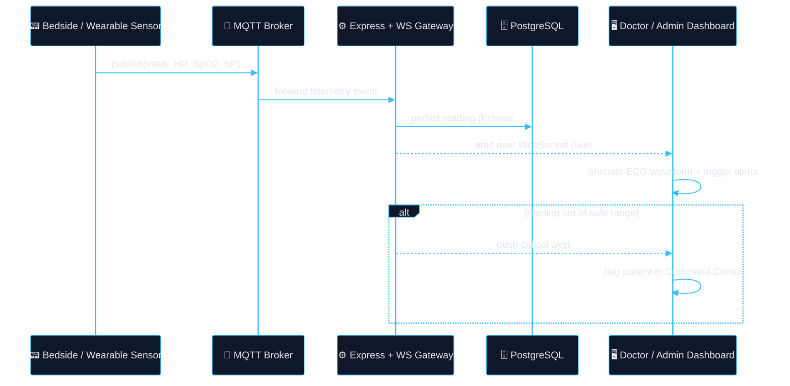
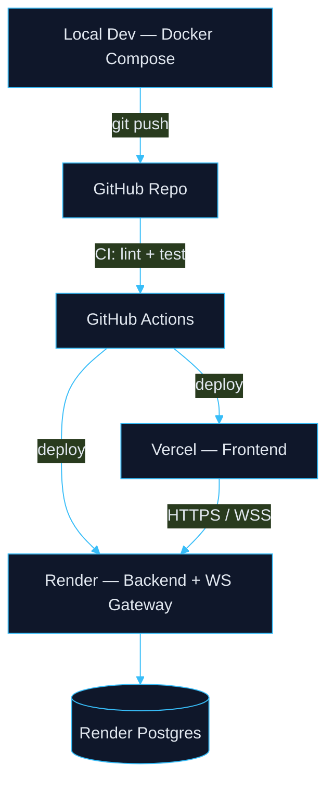

<div align="center">


<a href="https://github.com/anshumaan12-2003/healthcare-app">
  
</a>

<br/>


<br/>

<p align="center">
  
  
  
  
</p>

<p align="center">
  <a href="https://healthcare-app-dqw8.vercel.app">
    
  </a>
  <a href="https://medicore-backend-k0dj.onrender.com">
    
  </a>
</p>


</div>

<br/>

## 📖 Table of Contents

- [Architectural Vision](#-architectural-vision)
- [Tech Stack](#️-tech-stack)
- [System Architecture](#-system-architecture)
  - [High-Level System Map](#high-level-system-map)
  - [Real-Time Vitals Pipeline](#-real-time-vitals-pipeline)
  - [Deployment Topology](#️-deployment-topology)
- [Feature Matrix](#️-feature-matrix)
- [Getting Started](#-getting-started)
- [Environment Variables](#-environment-variables)
- [Project Structure](#-project-structure)
- [Demo Access](#-demo-access)
- [Roadmap](#-roadmap)
- [Contributing](#-contributing)
- [License](#-license)

<br/>

## 🌌 Architectural Vision

**MediCore+** goes beyond the traditional patient portal — it's a **Spatial Intelligence Clinic**. By combining a glassmorphic UI, **React Three Fiber** for 3D rendering, and **WebSockets** for live data, it creates a connected ecosystem across patients, doctors, and administrators, where vitals, schedules, and diagnostics update in real time instead of on page refresh.

<br/>

## 🛠️ Tech Stack

<div align="center">


<br/><br/>

| Layer | Technologies |
|---|---|
| **Frontend** | React · Vite · React Three Fiber · Framer Motion · Tailwind CSS |
| **Backend** | Node.js · Express · WebSockets (Socket.IO) |
| **Database** | PostgreSQL · Prisma ORM |
| **Infra / DevOps** | Docker · GitHub Actions · Vercel (frontend) · Render (backend) |
| **Realtime / IoT** | MQTT (telemetry) · WebRTC (video/tele-robotics) · Mapbox GL (fleet tracking) |

</div>

<br/>

## 🧩 System Architecture

<p align="center"></p>

### High-Level System Map



<br/>

### 🫀 Real-Time Vitals Pipeline

The pulse motif isn't just decoration — it mirrors how live data actually moves through the system: a sensor reading travels from device to dashboard in under a second, the same way a heartbeat propagates through an ECG trace.



<br/>

### ☁️ Deployment Topology



<br/>

## ⚡️ Feature Matrix

<table width="100%">
  <tr>
    <td width="55%" valign="middle">
      <h3>🧬 Patients</h3>
      <ul>
        <li><b>AR Physiotherapy</b> — real-time 3D joint tracking and bone rendering</li>
        <li><b>Genomic AI Dietitian</b> — syncs health data to generate dynamic meal plans</li>
        <li><b>Delivery Tracking</b> — live GPS tracking of medication delivery</li>
        <li><b>NLP Mood Tracker</b> — sentiment analysis on a private mental-health journal</li>
      </ul>
    </td>
    <td width="45%" align="center">
      
    </td>
  </tr>
  <tr>
    <td width="55%" valign="middle">
      <h3>🩺 Doctors</h3>
      <ul>
        <li><b>Tele-Consult</b> — secure WebRTC video for remote consultations</li>
        <li><b>AI Pre-Diagnostics</b> — LLM-assisted triage over patient EMRs</li>
        <li><b>MDT Chat</b> — multi-disciplinary secure messaging channels</li>
        <li><b>Population Heatmaps</b> — regional vitals and outbreak tracking</li>
      </ul>
    </td>
    <td width="45%" align="center">
      
    </td>
  </tr>
  <tr>
    <td width="55%" valign="middle">
      <h3>🏢 Admins</h3>
      <ul>
        <li><b>Command Center</b> — live ER / ICU capacity tracking</li>
        <li><b>Smart Grid IoT</b> — oxygen and power telemetry via MQTT</li>
        <li><b>Predictive Allocation</b> — bed-shortage forecasting from seasonal data</li>
        <li><b>Fleet Dispatch</b> — Mapbox GL routing for ambulance dispatch</li>
      </ul>
    </td>
    <td width="45%" align="center">
      
    </td>
  </tr>
</table>

> 💡 Replace the `docs/assets/*.gif` placeholders above with real screen recordings of each dashboard (e.g. via [ScreenToGif](https://www.screentogif.com/) or `ffmpeg`) — recruiters and visitors trust real product footage far more than stock gifs.


<br/>

## 🚀 Getting Started

### Prerequisites
- Node.js ≥ 18
- PostgreSQL ≥ 14 (or Docker)
- npm or pnpm

### 1. Clone the repository
```bash
git clone https://github.com/anshumaan12-2003/healthcare-app.git
cd healthcare-app
```

### 2. Backend setup
```bash
cd backend
cp .env.example .env   # then fill in your own values — see Environment Variables below
npm install
npx prisma db push
npm run db:seed
npm run dev
```

### 3. Frontend setup
```bash
cd ../frontend
cp .env.example .env
npm install
npm run dev
```

### 4. (Optional) Run with Docker Compose
```bash
docker compose up --build
```

<br/>

## 🔑 Environment Variables

Create a `.env` in `backend/` (never commit real secrets — this is illustrative only):

```env
DATABASE_URL=postgresql://<user>:<password>@localhost:5432/medicore
JWT_SECRET=<generate-a-strong-random-secret>
MQTT_BROKER_URL=<your-mqtt-broker>
MAPBOX_TOKEN=<your-mapbox-token>
PORT=5000
```

And in `frontend/`:

```env
VITE_API_BASE_URL=http://localhost:5000
VITE_WS_URL=ws://localhost:5000
VITE_MAPBOX_TOKEN=<your-mapbox-token>
```

<br/>

## 📂 Project Structure

```
healthcare-app/
├── backend/
│   ├── src/
│   │   ├── routes/          # REST endpoints
│   │   ├── controllers/
│   │   ├── services/        # business logic
│   │   ├── sockets/         # WebSocket gateway
│   │   └── prisma/          # schema + migrations
│   └── package.json
├── frontend/
│   ├── src/
│   │   ├── components/
│   │   ├── pages/           # patient / doctor / admin views
│   │   ├── scenes/          # React Three Fiber 3D scenes
│   │   └── hooks/
│   └── package.json
└── docker-compose.yml
```

<br/>

## 🔐 Demo Access

> ⚠️ **Seed data only.** These accounts exist purely for local/demo evaluation via `npm run db:seed` and are not present in any production database. Rotate or delete this seed before deploying publicly, and never reuse these credentials for a real account.

| Role | Email | Password |
| :--- | :--- | :--- |
| 🔴 Admin | `admin@medicore.com` | `password123` |
| 🔵 Doctor | `doctor@medicore.com` | `password123` |
| 🟢 Patient | `patient@medicore.com` | `password123` |

<br/>

## 🗺️ Roadmap

- [ ] Replace placeholder feature GIFs with real product recordings
- [ ] Add automated test suite (Jest / Vitest + Playwright)
- [ ] CI pipeline for lint, test, and preview deploys
- [ ] Role-based access control audit
- [ ] Accessibility pass (WCAG 2.1 AA) on all three dashboards

<br/>

## 🤝 Contributing

Contributions are welcome. Please open an issue to discuss significant changes before submitting a PR.

```bash
git checkout -b feature/your-feature
git commit -m "feat: describe your change"
git push origin feature/your-feature
```

<br/>

## 📄 License

Distributed under the MIT License. See `LICENSE` for details.

<div align="center">
<br/>


</div>
